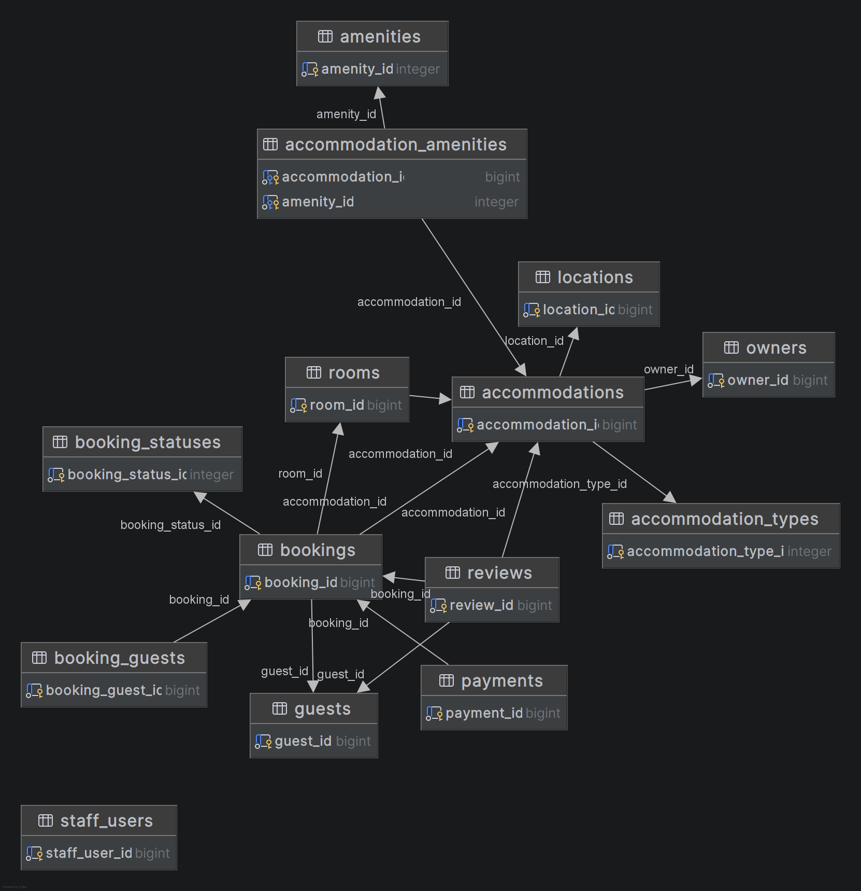

# reporte-SQL
# Consultas SQL - Gestión de Alojamientos Turísticos

## Motor de Base de Datos

PostgreSQL

## Schema utilizado

tourism

## Diagrama entidad-relación

## Descripción

Este repositorio contiene las 20 consultas SQL solicitadas en la actividad del Bootcamp MINEDUCYT-KODIGO.

Las consultas incluyen:

- INSERT
- SELECT
- UPDATE
- DELETE
- INNER JOIN
- LEFT JOIN
- Funciones de agregación
- HAVING
- Subconsultas

Además, se incluye un reporte PDF con capturas de ejecución y resultados obtenidos.

## Autor

Luis Pereira
